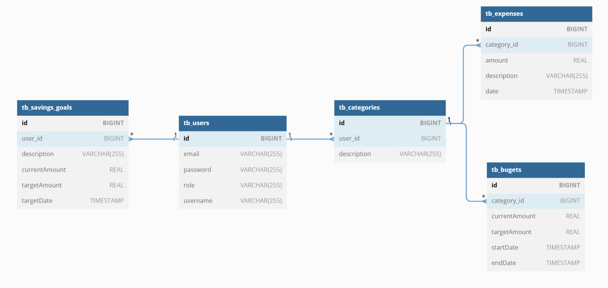
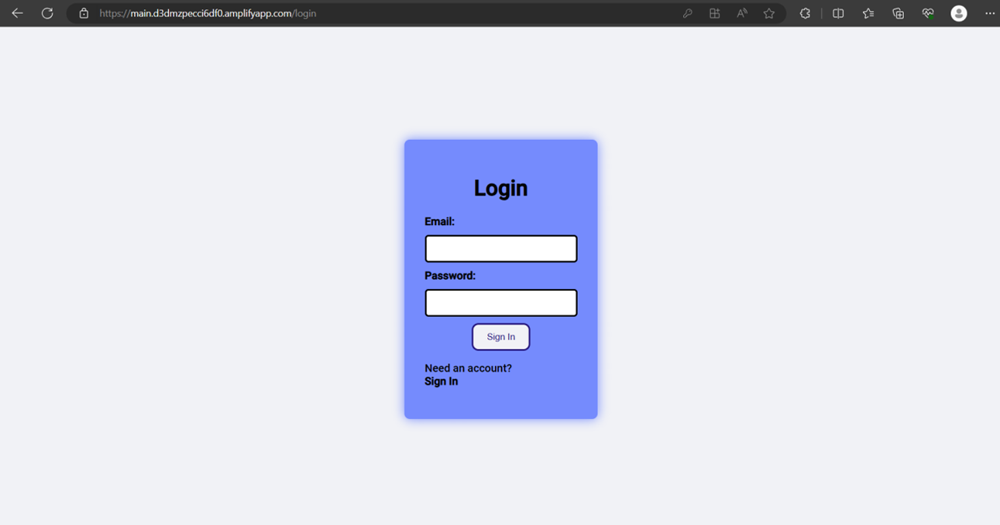
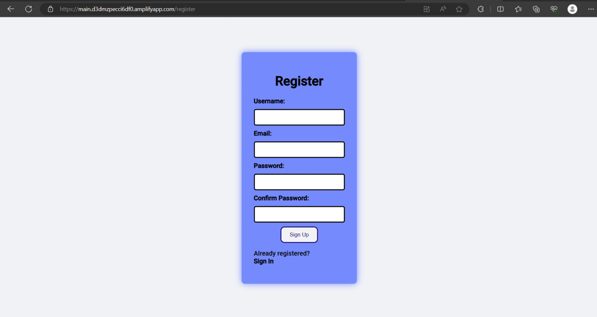
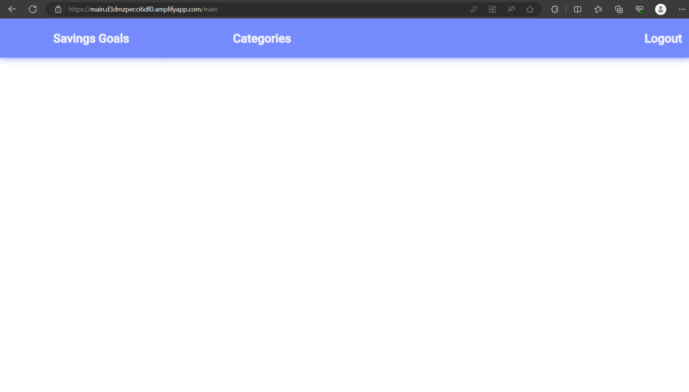
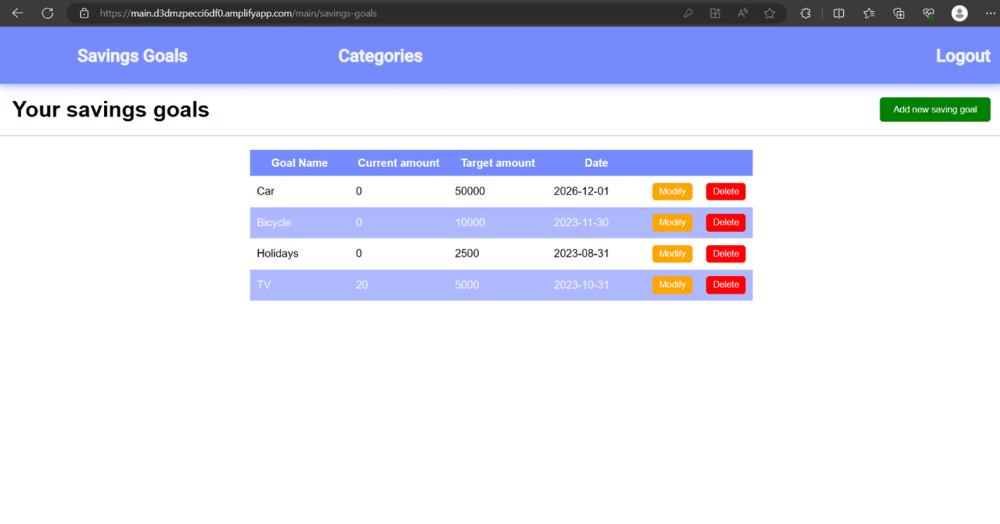
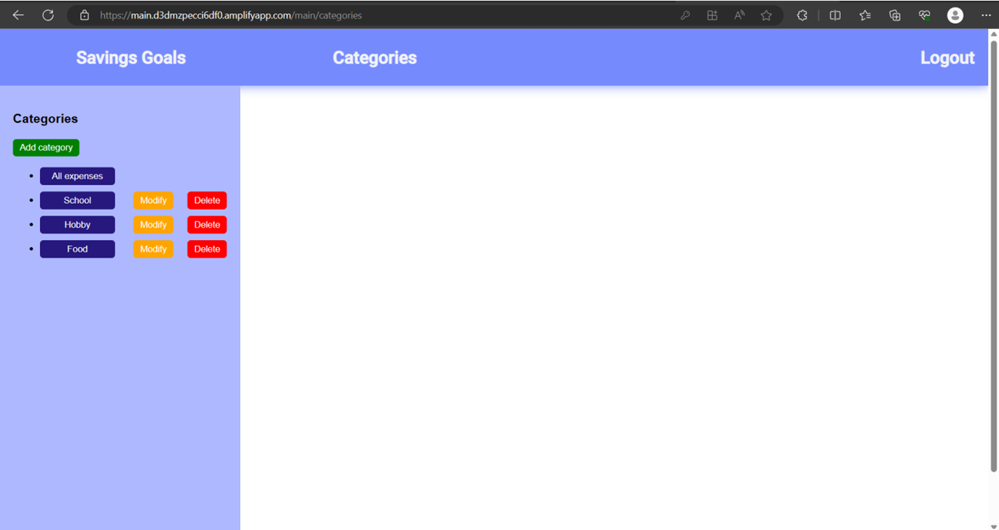
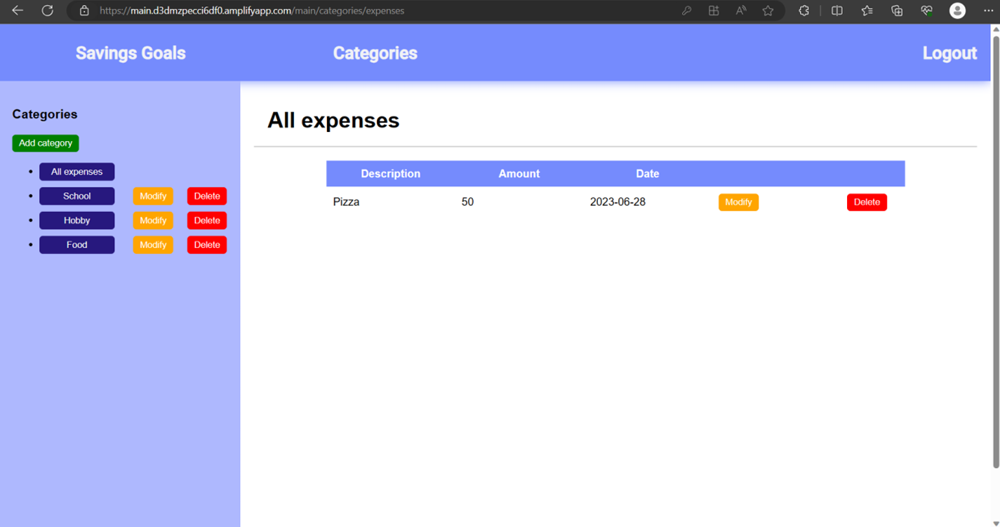
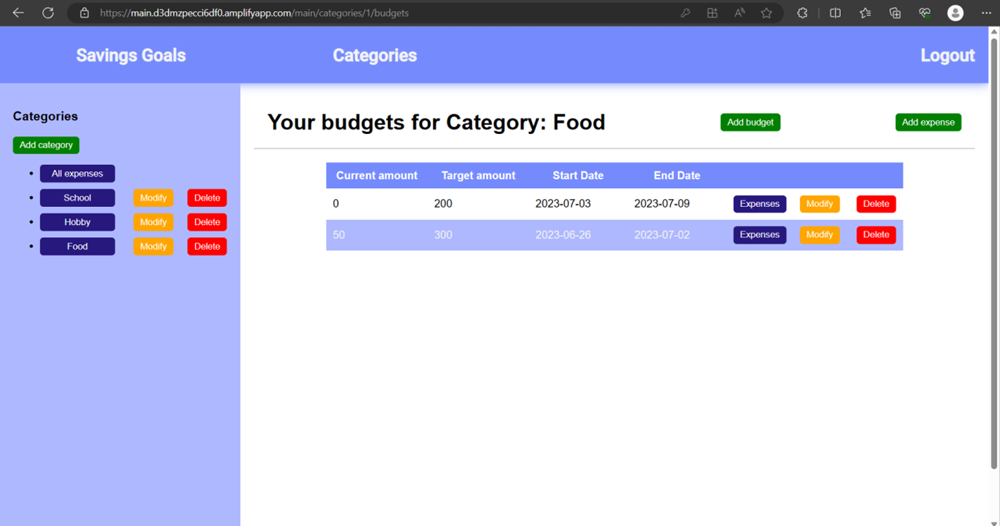
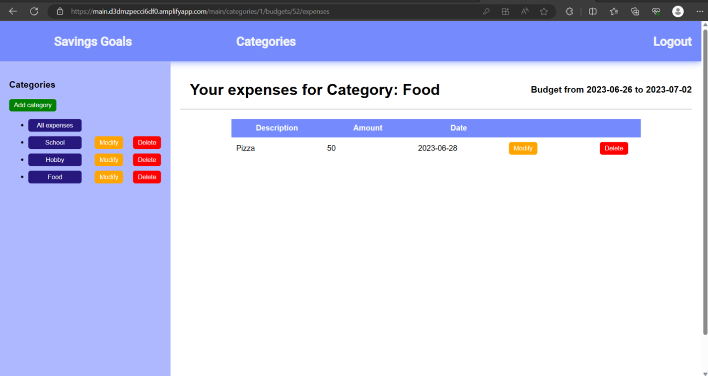

# FinancialManagementApp
## 1. Project Goal
The aim of this project was to create a simple finance management app that allows users to monitor and control expenses, plan budgets, and achieve savings goals. Users can register, log in, and track individual savings, expenses, and budgets. They can add, edit, and delete expenses, assign categories, and set budgets for different categories. The app also allows users to create and update savings goals to better manage their finances.

## 2. Functionalities
#### a) User Registration and Login
The app provides endpoints and interfaces for user registration and login.

#### b) Adding, Editing, and Deleting Savings Goals
The app offers endpoints and interfaces for viewing, adding, editing, and deleting savings goals.

#### c) Managing Categories for Expenses and Budgets
Endpoints and interfaces are available for viewing, adding, editing, and deleting categories for expenses and budgets.

#### d) Managing Expenses
Users can view, add, edit, and delete expenses through the provided endpoints and interfaces.

#### e) Managing Budgets
The app allows users to view, add, edit, and delete budgets with corresponding endpoints and interfaces.

## 3. Technologies Used

### Client:
- React.js

### Server:
- Jakarta EE with Spring, Spring Data, Spring Security, and Spring Boot
- AspectJ (event logging)
- JWT Token (user authorization)
- PostgreSQL (cloud-based using render.com)

## 4. Database

## 5. Server Endpoints
### Endpoints That Do Not Require Authorization
**POST:**
- `auth/register` – User registration
- `auth/authenticate` – User authentication
### Endpoints Requiring User Authorization (JWT token must be included in the request header)
**GET:**
- `/categories` – Returns all categories created by the user
- `/categories/{categoryId}` – Returns the category with the specified `{categoryId}`
- `/categories/{categoryId}/budget` – Returns all budgets belonging to the specified category
- `/categories/{categoryId}/budget/{budgetId}` – Returns the budget with the specified `{budgetId}`
- `/categories/{categoryId}/expenses/filter?startDate={startDate}&endDate={endDate}` – Returns all expenses in the specified category within the date range
- `/expenses` – Returns all expenses of the user
- `/savings-goals` – Returns all savings goals of the user

**PUT:**
- `/categories/{categoryId}` – Modifies the category with the specified `{categoryId}`
- `/categories/{categoryId}/budget/{budgetId}` – Modifies the budget with the specified `{budgetId}`
- `/categories/{categoryId}/expense/{expenseId}` – Modifies the expense with the specified `{expenseId}`
- `/savings-goals/{id}` – Modifies the savings goal with the specified `{id}`

**POST:**
- `/categories` – Adds a new category
- `/categories/{categoryId}/budget` – Adds a new budget to the specified category
- `/categories/{categoryId}/expense` – Adds a new expense to the specified category
- `/savings-goals` – Adds a new savings goal

**DELETE:**
- `/categories/{categoryId}` – Deletes the category with the specified `{categoryId}`
- `/categories/{categoryId}/budget/{budgetId}` – Deletes the budget with the specified `{budgetId}`
- `/categories/{categoryId}/expense/{expenseId}` – Deletes the expense with the specified `{expenseId}`
- `/savings-goals/{id}` – Deletes the savings goal with the specified `{id}`

## 6. User guide
Upon accessing the application page, the user sees a login form. If they don't have an account, they can navigate to the registration form.

After logging in or registering, the user is redirected to the main page of the application.

At this point, the user can view their savings goals (Savings Goals), navigate to expenses and budgets (Categories), or log out (Logout).

After navigating to the savings goals section, the user can see all their goals. They can add a new goal ("Add new saving goal") or modify and delete existing ones ("Modify" and "Delete" next to each goal). It's important to note that the user must manually update the amount of saved money.

After navigating to the categories section, the user can see the categories they have created. They can add a new category ("Add category") or modify and delete existing ones ("Modify" and "Delete" next to each category). Additionally, the user can view all their expenses ("All expenses").

The user can also navigate to a category of their choice.

At this point, the user can add new budgets and expenses for the selected category.
- The used budget is automatically updated when a new expense is added.
- The budget includes all expenses that occurred within the selected time range.
- If the user changes the date range for the category, the used budget will also be updated accordingly.

The user can view which expenses make up the currently used budget by navigating to the "Expenses" section.

At this point, the user can also update and modify their expenses.

#### Note:
If the user tries to manually change the URL to access a specific resource, they will be logged out and redirected to the login page.